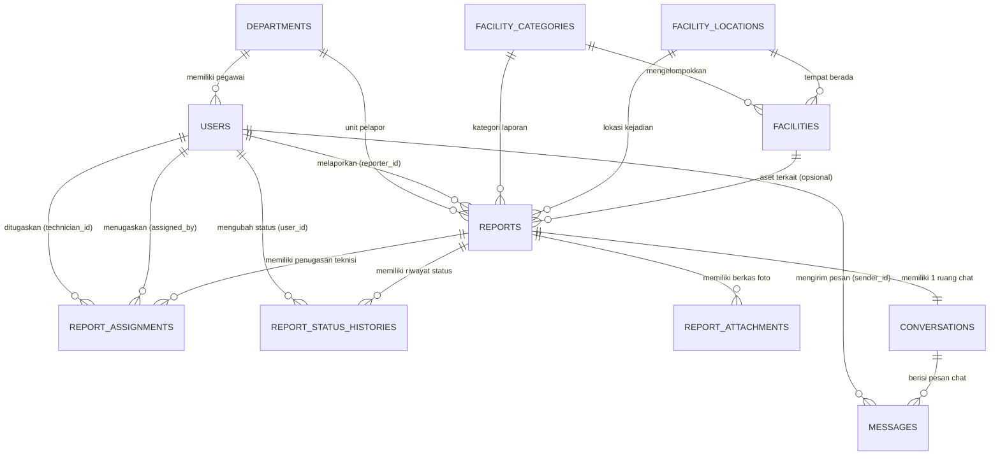

# Rancangan Basis Data: AFRS (AirNav Facility Damage Reporting System)

## Ringkasan Eksekutif
Dokumen ini menyajikan perancangan basis data relasional (MySQL 8.4 LTS) untuk **AFRS (Facility Reporting System)** — simulasi sistem pelaporan dan pengelolaan kerusakan fasilitas kerja pada lingkungan kantor AirNav Indonesia Cabang Medan (keperluan PKL).

Desain dirancang dengan prinsip **keterbacaan, integritas referensial (foreign keys), keamanan data, normalisasi 3NF, serta performa query** dengan indexing yang optimal untuk skenario single developer.

---

## 1. Analisis Kebutuhan Data Berdasarkan Fitur Sistem

Sistem AFRS memiliki fitur utama:
1. **Autentikasi & Otorisasi Multi-Role**: Pelapor (Employee), Teknisi Support, Supervisor Unit, dan Administrator. Membutuhkan data pengguna, departemen/unit kerja, dan role.
2. **Master Fasilitas**: Fasilitas kantor non-kritis (AC, printer, PC, jaringan, CCTV, furniture), kategori fasilitas, dan lokasi fisik (lantai, gedung, ruangan).
3. **Pelaporan & Lifecycle Kerusakan**: Nomor tiket unik, judul, deskripsi rinci, prioritas, status transisi, foto/lampiran kerusakan, pelapor, fasilitas terkait.
4. **Penugasan & Penanganan**: Penugasan teknisi oleh supervisor, catatan penanganan (*work logs* / catatan perbaikan), dokumentasi foto sesudah diperbaiki.
5. **Live Chat Terkait Tiket**: Komunikasi privat 1-on-1 / grup tiket antara pelapor, teknisi yang ditugaskan, dan supervisor. Dilengkapi pesan teks, attachment berkas, dan status terbaca (*read receipt*).
6. **Audit Trail & Riwayat**: Riwayat perubahan status laporan (*status histories*) dan catatan log aktivitas penting (*activity logs*) untuk evaluasi PKL.

---

## 2. Identifikasi Entitas Utama (11 Tabel Inti)

Untuk menjaga kesederhanaan (KISS principle) dan menghindari overengineering pada proyek PKL, seluruh kebutuhan dapat dipenuhi dengan **11 tabel**:

| No | Entitas / Tabel | Klasifikasi | Deskripsi Fungsi |
|---|---|---|---|
| 1 | `departments` | Master | Unit kerja / divisi di kantor (misal: Unit Teknik Otomasi, Komersil, Administrasi, dll.) |
| 2 | `users` | Inti | Akun seluruh pengguna beserta role, unit kerja, nomor telepon, dan status aktif |
| 3 | `facility_categories` | Master | Kategori fasilitas (Hardware IT, Jaringan, Pendingin Ruangan/AC, Kelistrikan, Furniture) |
| 4 | `facility_locations` | Master | Lokasi fisik fasilitas (Gedung, Lantai, Nama Ruangan) |
| 5 | `facilities` | Master | Data inventaris fasilitas kantor yang dapat dilaporkan (kode aset, nama, spesifikasi) |
| 6 | `reports` | Transaksional Inti | Tiket laporan kerusakan fasilitas |
| 7 | `report_status_histories`| Transaksional | Riwayat kronologis setiap perpindahan status laporan beserta catatan dan aktor |
| 8 | `report_assignments` | Transaksional | Riwayat dan data penugasan teknisi untuk laporan tertentu |
| 9 | `report_attachments` | Transaksional | Metadata file/foto bukti kerusakan (sebelum) dan bukti perbaikan (sesudah) |
| 10| `conversations` | Realtime Chat | Ruang percakapan privat yang terikat pada satu tiket laporan |
| 11| `messages` | Realtime Chat | Pesan chat dalam percakapan (teks, lampiran, pengirim) |

> [!NOTE]
> Untuk tabel sesi login (`sessions`) dan antrean latar belakang (`jobs`, `failed_jobs`), tabel standar Laravel 12 akan dibuat otomatis saat instalasi Laravel. Tabel `activity_logs` dapat digabungkan secara efisien dengan `report_status_histories` atau ditambahkan sebagai tabel audit sederhana.

---

## 3. Entity Relationship Diagram (ERD)



---

## 4. Spesifikasi Skema Tabel Rinci (Data Dictionary)

### 4.1 Tabel `departments`
Menyimpan data unit kerja / seksi dalam kantor AirNav Cabang Medan.
* **Fungsi**: Membedakan asal departemen pelapor dan mempermudah filter laporan per divisi.
* **Fields**:
  * `id` : `BIGINT UNSIGNED`, PK, Auto-Increment
  * `name` : `VARCHAR(100)`, NOT NULL, UNIQUE (Contoh: "Unit IT & Otomasi", "Unit Keuangan", "Unit Operasi Pelayanan")
  * `code` : `VARCHAR(20)`, NOT NULL, UNIQUE (Contoh: "IT", "KEU", "OPS")
  * `description` : `TEXT`, NULLABLE
  * `is_active` : `BOOLEAN`, DEFAULT `TRUE`
  * `created_at`, `updated_at` : `TIMESTAMP`

### 4.2 Tabel `users`
Menyimpan akun pengguna aplikasi beserta role dan relasi unit kerjanya.
* **Fungsi**: Autentikasi dan otorisasi.
* **Fields**:
  * `id` : `BIGINT UNSIGNED`, PK, Auto-Increment
  * `department_id` : `BIGINT UNSIGNED`, FK -> `departments(id)`, ON DELETE SET NULL, NULLABLE
  * `name` : `VARCHAR(100)`, NOT NULL
  * `username` : `VARCHAR(50)`, NOT NULL, UNIQUE (Nomor Induk Pegawai / identitas login)
  * `email` : `VARCHAR(100)`, NOT NULL, UNIQUE
  * `password` : `VARCHAR(255)`, NOT NULL (Hash bcrypt/argon2)
  * `phone` : `VARCHAR(20)`, NULLABLE (Kontak WhatsApp/telepon untuk koordinasi darurat)
  * `role` : `ENUM('admin', 'supervisor', 'technician', 'employee')`, NOT NULL, DEFAULT `'employee'`
  * `avatar_url` : `VARCHAR(255)`, NULLABLE
  * `is_active` : `BOOLEAN`, DEFAULT `TRUE`
  * `remember_token` : `VARCHAR(100)`, NULLABLE
  * `created_at`, `updated_at` : `TIMESTAMP`
  * `deleted_at` : `TIMESTAMP`, NULLABLE (Soft delete)

### 4.3 Tabel `facility_categories`
Kategori jenis fasilitas kantor.
* **Fields**:
  * `id` : `BIGINT UNSIGNED`, PK, Auto-Increment
  * `name` : `VARCHAR(100)`, NOT NULL, UNIQUE (Contoh: "Perangkat Komputer / IT", "Pendingin Udara (AC)", "Jaringan & Internet", "Kelistrikan & Lampu", "Perabot Kantor")
  * `slug` : `VARCHAR(100)`, NOT NULL, UNIQUE
  * `description` : `VARCHAR(255)`, NULLABLE
  * `icon` : `VARCHAR(50)`, NULLABLE (Nama icon Lucide, misal: "monitor", "air-vent", "wifi")
  * `is_active` : `BOOLEAN`, DEFAULT `TRUE`
  * `created_at`, `updated_at` : `TIMESTAMP`

### 4.4 Tabel `facility_locations`
Data fisik penempatan fasilitas di gedung/ruangan kantor.
* **Fields**:
  * `id` : `BIGINT UNSIGNED`, PK, Auto-Increment
  * `building` : `VARCHAR(100)`, NOT NULL (Contoh: "Gedung Administrasi", "Gedung Penunjang Operasi")
  * `floor` : `VARCHAR(20)`, NOT NULL (Contoh: "Lantai 1", "Lantai 2")
  * `room_name` : `VARCHAR(100)`, NOT NULL (Contoh: "Ruang Rapat Utama", "Ruang Subseksi IT", "Lobi Utama")
  * `description` : `VARCHAR(255)`, NULLABLE
  * `created_at`, `updated_at` : `TIMESTAMP`
* **Unique Constraint**: `UNIQUE KEY uk_building_floor_room (building, floor, room_name)`

### 4.5 Tabel `facilities`
Katalog inventaris fasilitas yang dapat dilaporkan secara spesifik.
* **Fields**:
  * `id` : `BIGINT UNSIGNED`, PK, Auto-Increment
  * `category_id` : `BIGINT UNSIGNED`, FK -> `facility_categories(id)`, ON DELETE RESTRICT
  * `location_id` : `BIGINT UNSIGNED`, FK -> `facility_locations(id)`, ON DELETE RESTRICT
  * `facility_code` : `VARCHAR(50)`, NOT NULL, UNIQUE (Contoh: "AST-AC-001", "AST-PC-014")
  * `name` : `VARCHAR(150)`, NOT NULL (Contoh: "AC Daikin Inverter 2PK Ruang Rapat")
  * `brand_model` : `VARCHAR(100)`, NULLABLE (Contoh: "Daikin FTKQ50SVM4")
  * `serial_number` : `VARCHAR(100)`, NULLABLE
  * `status` : `ENUM('operational', 'damaged', 'maintenance', 'retired')`, DEFAULT `'operational'`
  * `notes` : `TEXT`, NULLABLE
  * `created_at`, `updated_at` : `TIMESTAMP`
  * `deleted_at` : `TIMESTAMP`, NULLABLE

### 4.6 Tabel `reports`
Pusat dari seluruh sistem penanganan kerusakan fasilitas.
* **Fields**:
  * `id` : `BIGINT UNSIGNED`, PK, Auto-Increment
  * `ticket_number` : `VARCHAR(32)`, NOT NULL, UNIQUE (Format: `REP-YYYYMMDD-XXXX`, contoh: `REP-20260923-0001`)
  * `reporter_id` : `BIGINT UNSIGNED`, FK -> `users(id)`, ON DELETE RESTRICT
  * `department_id` : `BIGINT UNSIGNED`, FK -> `departments(id)`, ON DELETE RESTRICT (Divisi saat pelaporan)
  * `category_id` : `BIGINT UNSIGNED`, FK -> `facility_categories(id)`, ON DELETE RESTRICT
  * `location_id` : `BIGINT UNSIGNED`, FK -> `facility_locations(id)`, ON DELETE RESTRICT
  * `facility_id` : `BIGINT UNSIGNED`, NULLABLE, FK -> `facilities(id)`, ON DELETE SET NULL (Bisa NULL jika pelapor tidak tahu kode aset spesifik)
  * `title` : `VARCHAR(200)`, NOT NULL (Ringkasan masalah, contoh: "AC Ruang Rapat Bocor dan Tidak Dingin")
  * `description` : `TEXT`, NOT NULL (Deskripsi detail indikasi kerusakan)
  * `priority` : `ENUM('low', 'medium', 'high', 'urgent')`, NOT NULL, DEFAULT `'medium'`
  * `status` : `ENUM('submitted', 'under_review', 'assigned', 'in_progress', 'waiting_information', 'on_hold', 'resolved', 'closed', 'rejected')`, NOT NULL, DEFAULT `'submitted'`
  * `resolution_notes` : `TEXT`, NULLABLE (Ringkasan hasil perbaikan teknisi saat status `resolved`)
  * `rejection_reason` : `VARCHAR(255)`, NULLABLE (Alasan penolakan jika status `rejected`)
  * `submitted_at` : `TIMESTAMP`, NOT NULL
  * `resolved_at` : `TIMESTAMP`, NULLABLE
  * `closed_at` : `TIMESTAMP`, NULLABLE
  * `created_at`, `updated_at` : `TIMESTAMP`
  * `deleted_at` : `TIMESTAMP`, NULLABLE (Audit trail soft delete)

### 4.7 Tabel `report_status_histories`
Pencatatan riwayat perpindahan status (audit log siklus hidup laporan).
* **Fungsi**: Timeline transparan yang bisa dilihat oleh pelapor, teknisi, maupun supervisor.
* **Fields**:
  * `id` : `BIGINT UNSIGNED`, PK, Auto-Increment
  * `report_id` : `BIGINT UNSIGNED`, FK -> `reports(id)`, ON DELETE CASCADE
  * `user_id` : `BIGINT UNSIGNED`, FK -> `users(id)`, ON DELETE RESTRICT (Pengubah status)
  * `from_status` : `VARCHAR(50)`, NULLABLE (Status sebelum transisi, NULL saat pertama kali dibuat)
  * `to_status` : `VARCHAR(50)`, NOT NULL (Status tujuan)
  * `action_note` : `TEXT`, NULLABLE (Catatan alasan transisi, misal: "Menunggu sparepart kipas AC dari vendor")
  * `created_at` : `TIMESTAMP`

### 4.8 Tabel `report_assignments`
Penugasan teknisi untuk menangani laporan.
* **Fungsi**: Mendukung penugasan multi-teknisi jika diperlukan atau mencatat pergantian teknisi.
* **Fields**:
  * `id` : `BIGINT UNSIGNED`, PK, Auto-Increment
  * `report_id` : `BIGINT UNSIGNED`, FK -> `reports(id)`, ON DELETE CASCADE
  * `technician_id` : `BIGINT UNSIGNED`, FK -> `users(id)`, ON DELETE RESTRICT
  * `assigned_by` : `BIGINT UNSIGNED`, FK -> `users(id)`, ON DELETE RESTRICT (Supervisor penugaskan)
  * `status` : `ENUM('active', 'reassigned', 'completed')`, DEFAULT `'active'`
  * `notes` : `VARCHAR(255)`, NULLABLE (Instruksi dari supervisor ke teknisi)
  * `assigned_at` : `TIMESTAMP`, NOT NULL
  * `completed_at` : `TIMESTAMP`, NULLABLE
  * `created_at`, `updated_at` : `TIMESTAMP`

### 4.9 Tabel `report_attachments`
File dan gambar dokumentasi yang diunggah pelapor maupun teknisi.
* **Fields**:
  * `id` : `BIGINT UNSIGNED`, PK, Auto-Increment
  * `report_id` : `BIGINT UNSIGNED`, FK -> `reports(id)`, ON DELETE CASCADE
  * `user_id` : `BIGINT UNSIGNED`, FK -> `users(id)`, ON DELETE RESTRICT (Uploader)
  * `type` : `ENUM('initial_evidence', 'progress_evidence', 'completion_evidence')`, NOT NULL
  * `file_name` : `VARCHAR(255)`, NOT NULL (Nama file asli)
  * `file_path` : `VARCHAR(255)`, NOT NULL (Path di Laravel Storage)
  * `file_type` : `VARCHAR(50)`, NOT NULL (MIME type: `image/jpeg`, `image/png`, `application/pdf`)
  * `file_size` : `INT UNSIGNED`, NOT NULL (Ukuran dalam bytes)
  * `created_at`, `updated_at` : `TIMESTAMP`

### 4.10 Tabel `conversations`
Entitas ruang percakapan live chat yang terikat **1-to-1** dengan laporan.
* **Fungsi**: Mengelompokkan riwayat chat per tiket pelaporan secara privat.
* **Fields**:
  * `id` : `BIGINT UNSIGNED`, PK, Auto-Increment
  * `report_id` : `BIGINT UNSIGNED`, FK -> `reports(id)`, ON DELETE CASCADE, UNIQUE (1 laporan = 1 room)
  * `is_locked` : `BOOLEAN`, DEFAULT `FALSE` (Otomatis terkunci saat laporan `closed` atau `rejected`)
  * `last_message_at` : `TIMESTAMP`, NULLABLE (Untuk optimasi sorting daftar chat tanpa query count berat)
  * `created_at`, `updated_at` : `TIMESTAMP`

### 4.11 Tabel `messages`
Pesan individual yang dikirim di dalam ruang percakapan.
* **Fungsi**: Menyimpan isi chat realtime dengan fallback HTTP penuh.
* **Fields**:
  * `id` : `BIGINT UNSIGNED`, PK, Auto-Increment
  * `conversation_id` : `BIGINT UNSIGNED`, FK -> `conversations(id)`, ON DELETE CASCADE
  * `sender_id` : `BIGINT UNSIGNED`, FK -> `users(id)`, ON DELETE RESTRICT
  * `message` : `TEXT`, NOT NULL
  * `attachment_path` : `VARCHAR(255)`, NULLABLE (Lampiran gambar chat jika ada)
  * `is_read` : `BOOLEAN`, DEFAULT `FALSE`
  * `read_at` : `TIMESTAMP`, NULLABLE
  * `created_at`, `updated_at` : `TIMESTAMP`

---

## 5. Rancangan Siklus Hidup Status Laporan (State Machine)

Berikut adalah aturan transisi status laporan:

```text
[SUBMITTED]
   │
   ├──> [REJECTED] (Ditolak oleh Supervisor dengan alasan)
   │
   └──> [UNDER_REVIEW] (Ditinjau oleh Supervisor)
           │
           └──> [ASSIGNED] (Ditugaskan ke Teknisi)
                   │
                   └──> [IN_PROGRESS] (Teknisi mulai mengerjakan)
                           │
                           ├──> [WAITING_INFORMATION] (Menunggu info pelapor via chat)
                           │       └──> [IN_PROGRESS]
                           │
                           ├──> [ON_HOLD] (Menunggu sparepart/vendor)
                           │       └──> [IN_PROGRESS]
                           │
                           └──> [RESOLVED] (Teknisi selesai & isi catatan penanganan)
                                   │
                                   └──> [CLOSED] (Dikonfirmasi pelapor / auto-closed oleh sistem)
```

### Matriks Otorisasi Transisi Status:
1. **Pelapor**: Mengajukan tiket (`SUBMITTED`), mengonfirmasi selesai (`CLOSED`).
2. **Supervisor**: Mengubah ke `UNDER_REVIEW`, `ASSIGNED`, `REJECTED`, atau `CLOSED`.
3. **Teknisi**: Mengubah ke `IN_PROGRESS`, `WAITING_INFORMATION`, `ON_HOLD`, dan `RESOLVED`.
4. **Admin**: Memiliki kemampuan bypass dalam kasus audit / intervensi administratif.

---

## 6. Arsitektur Realtime Live Chat (Laravel Reverb + Private Channel)

1. **Keamanan Channel**:
   * Nama Channel: `private-report.chat.{reportId}`
   * Autorisasi di `routes/channels.php`:
     ```php
     Broadcast::channel('report.chat.{reportId}', function ($user, $reportId) {
         $report = Report::find($reportId);
         if (!$report) return false;
         
         // Pelapor pemilik tiket
         if ($user->id === $report->reporter_id) return true;
         
         // Teknisi yang sedang ditugaskan
         $isAssigned = $report->assignments()->where('technician_id', $user->id)->exists();
         if ($isAssigned) return true;
         
         // Supervisor unit atau Admin
         if (in_array($user->role, ['supervisor', 'admin'])) return true;
         
         return false;
     });
     ```
2. **Siklus Simpan & Broadcast**:
   * Request masuk via `POST /api/reports/{id}/messages`.
   * Pesan divalidasi dan disimpan ke tabel `messages`.
   * Event `MessageSent` di-trigger ke Laravel Reverb via private channel.
   * Frontend (Inertia + React + Echo) menerima payload dan meng-append pesan ke UI tanpa polling.
   * **Fallback**: Jika koneksi WebSocket terputus, pesan tetap ada di DB dan dirender saat page load / re-visit.

---

## 7. Strategi Indexing & Optimasi Query

Untuk memastikan aplikasi responsif dan cepat pada data bertumbuh:
1. `reports`:
   * Index: `(status, created_at)` -> Untuk filter tab status di dashboard & sorting pagination.
   * Index: `(reporter_id)` -> Query cepat "Laporan Saya".
   * Index: `(category_id)`, `(location_id)` -> Filter laporan.
   * Unique Index: `(ticket_number)` -> Pencarian instan per nomor tiket.
2. `messages`:
   * Index: `(conversation_id, created_at)` -> Query cepat memuat pesan berurut kronologis per room.
3. `report_status_histories`:
   * Index: `(report_id, created_at)` -> Menampilkan timeline penanganan.
4. `report_assignments`:
   * Index: `(technician_id, status)` -> Query cepat dashboard teknisi ("Tugas Aktif Saya").

---

## 8. Verifikasi & Langkah Selanjutnya

Sebelum berpindah ke pembuatan kode dan instalasi:
* [x] Struktur 11 tabel mencakup seluruh spesifikasi tanpa tabel yang berlebihan (*no bloat*).
* [x] Integritas data terjamin dengan FK, Cascades, dan Soft Deletes pada entitas kritis.
* [x] Relasi chat terisolasi 1-to-1 dengan private channel authorization.
* [ ] **Review & Persetujuan Pengguna**: Meminta tanggapan atau penyesuaian dari pengguna sebelum inisialisasi project Laravel 12 & migration.
